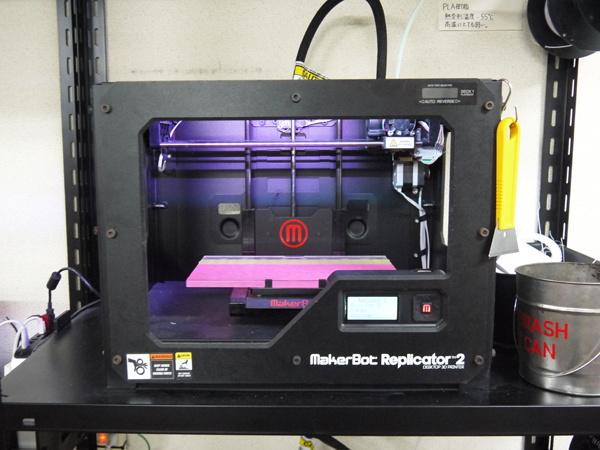
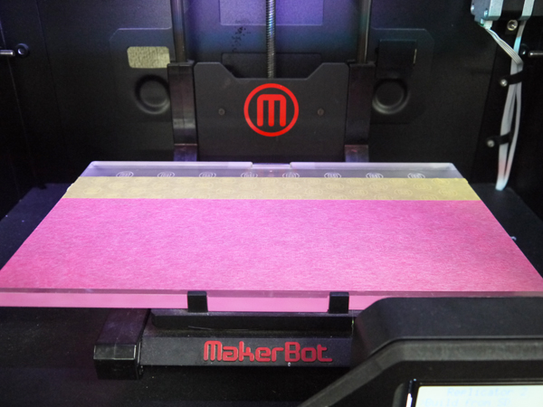

# 01.マシンとソフトウェアの起動
  

## 01.1 マシンの起動
 

 
 

マシン本体裏側にある電源スイッチを入れます。 
 
 
 

## 01.2 ベッド（プリントテーブル）の確認
 

 
 

ベッドには、造形物の食い付きを良くするために専用のマスキングテープを貼っています。 
もしマスキングテープに大きな傷があったり、剥がれている場合はスタッフに相談してください。 
 
 
 

## 01.3 Makerbot Desktopの起動
 

 
 

メニューバーの上記アイコンをダブルクリックし、 
Makerbot社の3Dプリンタ専用ソフト「[Makerbot Desktop](https://support.makerbot.com/s/article/Download-MakerBot-Desktop)」を起動します。 
 
 
 
