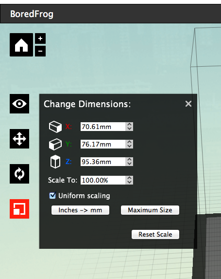

# 02.プリントデータ設定(1)
  

## 02.1 3Dデータ読み込み
 

 
 

Makerbot Desktop上部のメニュー表示されている**「Add File」**をクリックします。 
 

 
 

ウィンドウが開いたら、使用するデータを選択し**「Open」**をクリックします。 
 

 
 

そうすると、Makerbot Desktopのウィンドウ内に3Dデータが表示されます。 
 
 
 

## 02.2 画面の操作
 

 
 

* **ズームイン・アウト：** マウスのスクロール
* **360度自由回転：** マウスの左（or右）クリック＋ドラッグ  
* **視点の平行移動：** Shiftキーを押しながら、マウスの左（or右）クリック＋ドラッグ 
※視点を元の位置に戻す場合には、画面左側の家型のボタン（Reset view）をクリックしてください。 
 
 
 

## 02.3 視点位置の変更
 

 
 

画面左側の**「Change View」**メニューで、3Dデータを見る方向を変更できます。 
* **Top：** 上面から見る
* **Side：** 側面から見る
* **Front：** 正面から見る
 
 
 
 

## 02.4 3Dデータのプリント位置の調整
 

 
 

画面左側の**「Chanrge Position」**メニューで、3Dデータのプリント位置を調整できます。 
※このとき、移動させたい3Dデータを必ず選択しておくこと！ 
* **X,Y,Z：** それぞれの欄に数字を入力すると、各方向に3Dデータが移動します。
* **On Platform：** 3Dデータをベッドに接地させます。
* **Center：** 3Dデータをベッドの中心に移動させます。
* **Reset Position：** 3Dデータを読み込み時の位置に戻します。
 
 
 
 

## 02.5 3Dデータのプリント角度の調整
 

 
 

画面左側の**「Chanrge Rotation」**メニューで、3Dデータのプリント角度を調整できます。 
※このとき、移動させたい3Dデータを必ず選択しておくこと！ 
* **X,Y,Z：** それぞれの欄に数字を入力すると、各軸を中心に3Dデータが回転します。
* **Lay Flat：** 3Dデータとベッドとの接地面がなるべく大きくなるよう、自動的に角度を変更します。
* **Reset Position：** 3Dデータを読み込み時の角度に戻します。
 
 
 
 

## 02.6 3Dデータのプリントサイズの調整
 

 
 

画面左側の**「Chanrge Dimensions」**メニューで、3Dデータのプリントサイズを調整できます。 
※このとき、移動させたい3Dデータを必ず選択しておくこと！ 
* **X,Y,Z：** それぞれの欄に数字を入力すると、各軸方向に3Dデータのサイズが変更されます。
* **Uniform scaling**にチェックを入れると、一定の比率を保ちながら寸法を変更可能です。
* **inches -> mm：** サイズの表記をインチからミリに変更します。
* **Maximum Size：** マシンでプリント可能な最大サイズに変更します。
* **Reset Scale：** 3Dデータを読み込み時のサイズに戻します。
 
 
 
 

## 02.7 3Dデータの調整完了
 

 
 

全ての調整が完了したら、次のステップへ進みます。 
