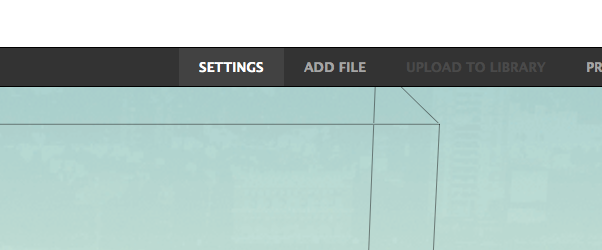

# 03.プリントデータ設定(2)
  

 
 

Makerbot Desktop上部のメニュー表示されている**「SETTING」**をクリックします。 
 

 
 

**「Quick」**タブを開き、プリントの設定を行います。 
 

* **「Quality」解像度：** 各項目ごとに、次の厚さずつ材料が積層されていきます。 
Low = 0.3mm ／ Standard ／ 0.2mm ／ High = 0.1mm
* **「Infill」密度：** 造形物の内部に詰める材料の量を設定します。 
0〜100%まで設定が可能です。（通常は10%前後でOKです。）   
* **「Raft」ラフト：** プリントする造形物とベッドとの接地面が小さい場合に、 
食い付きを良くするための予備土台の有無を設定することができます。
* **「Support」サポート：** プリントする造形物の形状が不安定な場合に、 
積層をサポートする材料の有無を設定することができます。
* **「Extrude Tempareture」ノズルの温度：** 使用するフィラメントの材質によって 
温度を設定することができます。（通常は230℃程度でOKです。）

 

全ての設定が完了したら**「OK」**をクリックします。 
