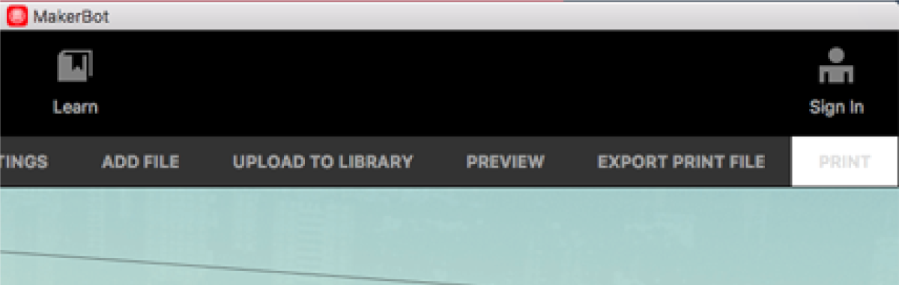
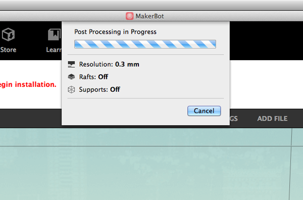
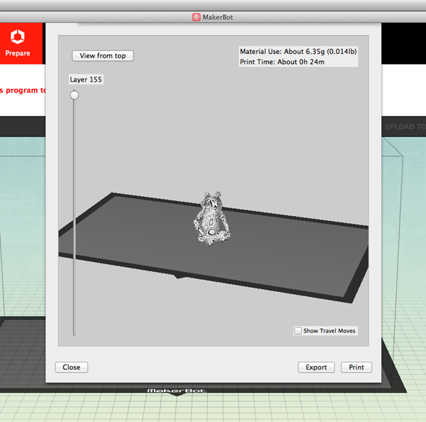
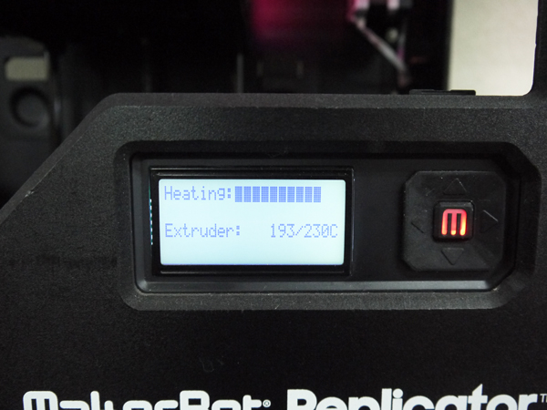
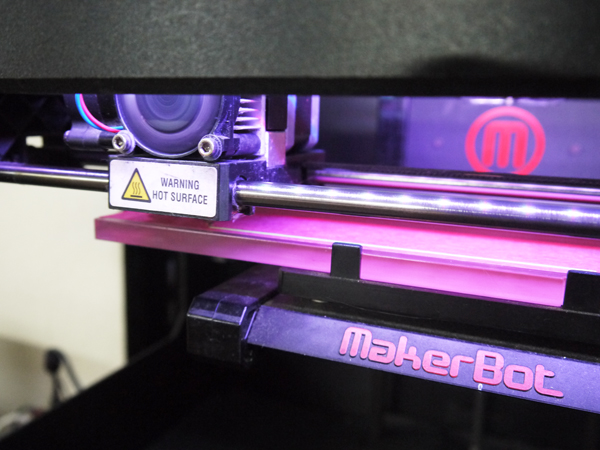

# 04.プリント
  

 
 

Makerbot Desktop上部のメニュー表示されている**「PREVIEW」**をクリックします。 
 

 
 

プレビューデータへの変換が行われます。 
RaftやSupportなどが設定値と異なっていても問題ありません。 
 

 
 

右上に表示されているPrint Time（印刷にかかる時間）と印刷イメージを確認し、 
問題がなければ**「Print」**をクリックします。 
そうするとデータが3Dプリンタへ転送されます。 
 

 
 

マシンのディスプレイに表示されている**「Extruder」**という項目が、 
**230℃**に達するとプリントがスタートします。 
 

 
 

プリントがスタートすると、線がテストで出力されます。 
これがきちんと出力されない場合はノズル詰まりが起こっている可能性があるため、 
すぐにプリントを停止する必要があります。 
※プリントの停止方法は**06.プリントのキャンセル**を参照してください。
