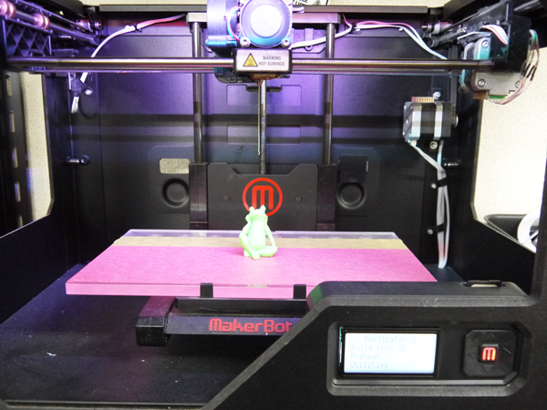
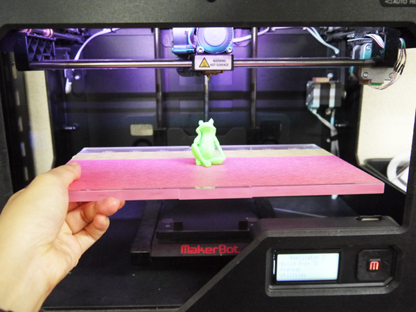
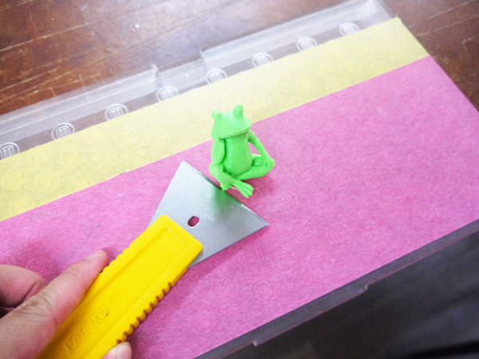
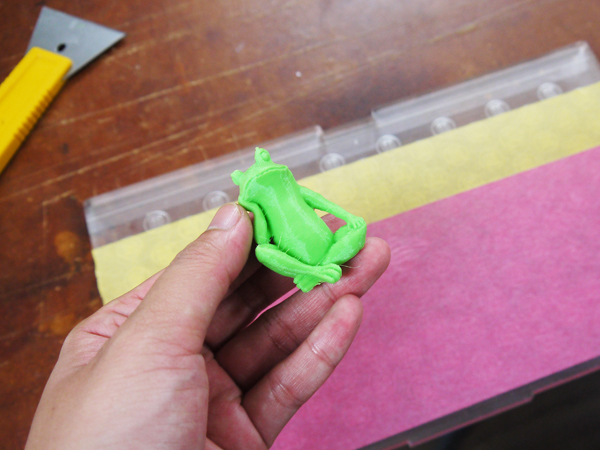
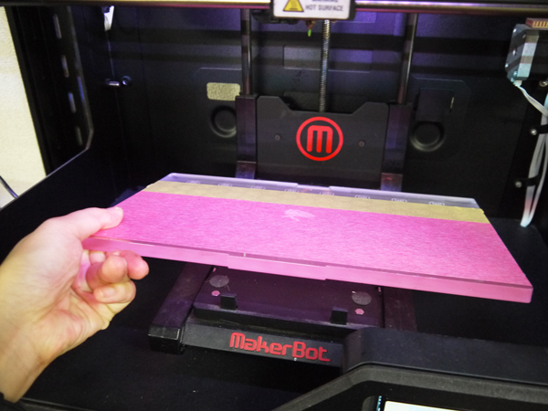

# 05.プリント完了
  

 
 

プリントが完了するとメロディが鳴ってベッドが下がります。 
 

 
 

ベッドはマシンに固定されているので、奥側の黒いツメを向こう側に押しながらベッドを取り外します。 
このときに無理に力をかけるとベッドの水平が乱れるので、慎重に作業をしてください。 
 

  
 

ヘラなどを使って、造形物をベッドから取り外します。 
このときベッド表面のマスキングテープに傷が付いていたり剥がれたりしていたら貼り替えます。 
 

 
 

造形物の取り外し等が完了したら、マシンの奥側の黒いツメを向こう側に押しながらベッドを戻します。 
