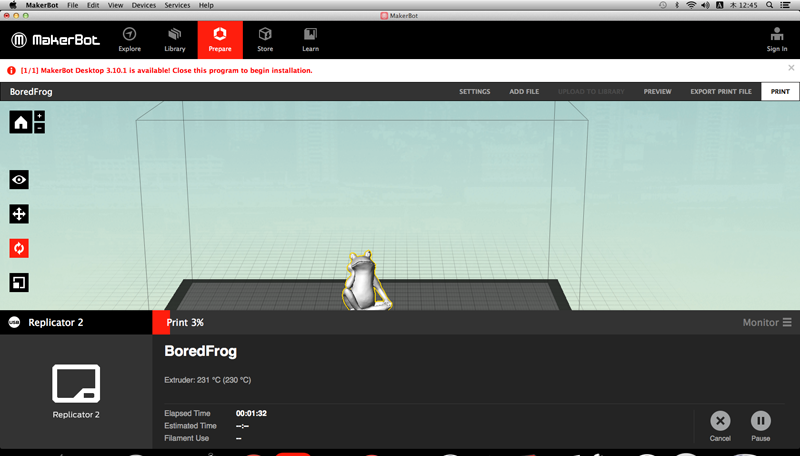
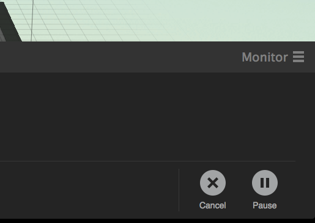
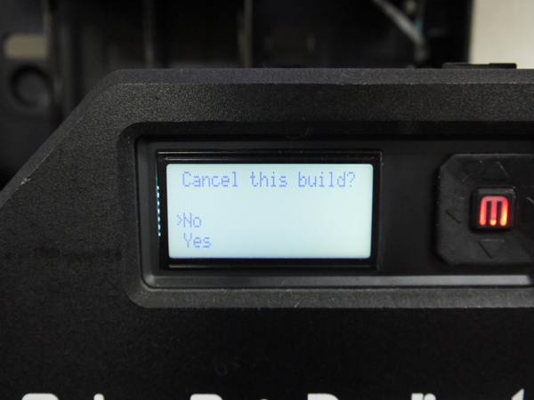

# 06.プリントの停止・キャンセル
  

## A. Makerbot Desktop（ソフトウェア）で操作する場合
 

 
 

Makerbot Desktopの右下の**Monitor**をクリックします。 
 

 
 

上のようなメニューが表示されます。 
 

 
 

右下の**Cancel**をクリックするとプリントが停止され、**Pause**をクリックすると一時停止します。 
 
 
 

## B. マシン本体で操作する場合
 

 
 

本体ディスプレイ脇にある、**左向き矢印ボタン**を1回押します。 
 

 
 

そうすると、上のようなメニューが表示されます。 
**Pause**を選択して **「M」ボタン**を押すと、プリントが一時停止する。 
プリントをキャンセルする場合は、**Cancel Build**を選択して **「M」ボタン**を押します。 
 

 
 

プリントをキャンセルする場合は、次に表示される画面で**Yes**を選択して **「M」ボタン**を押します。 
 
