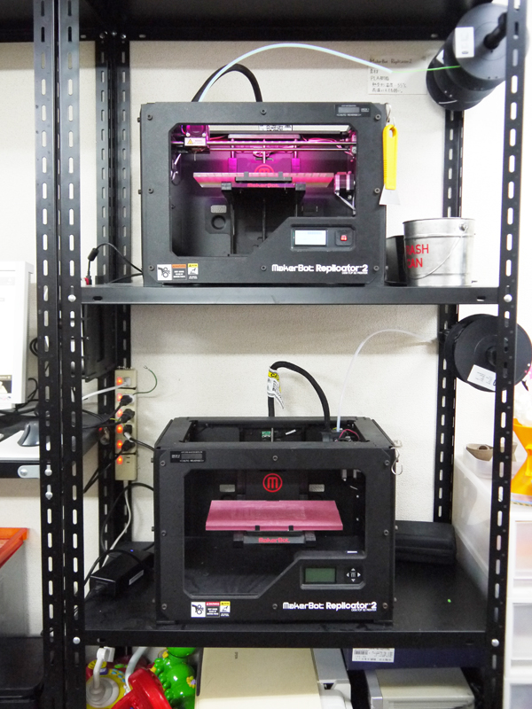
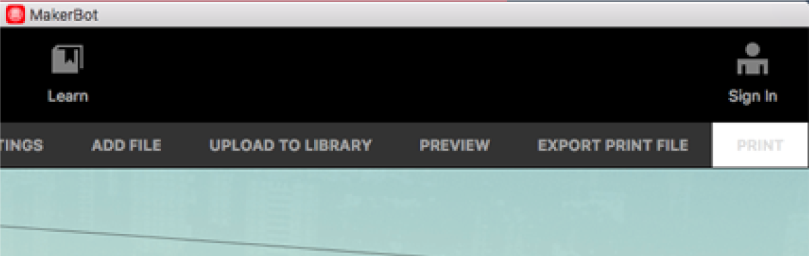
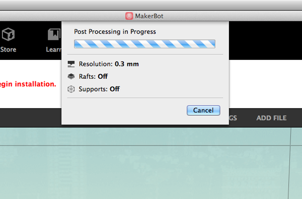
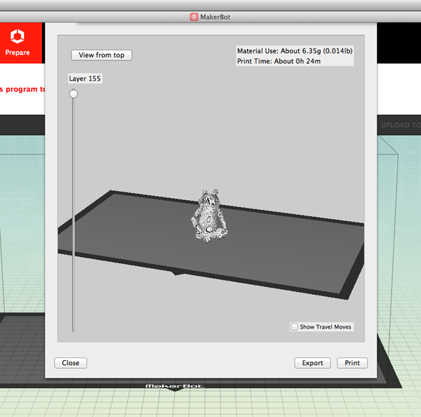
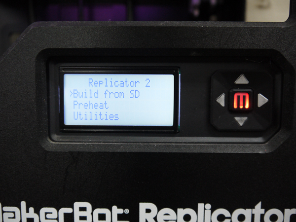
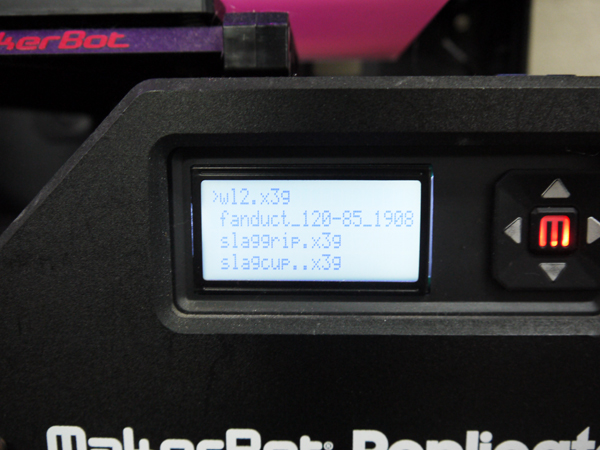
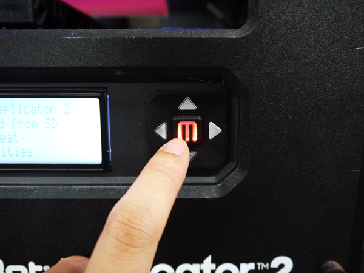

# 07.SDカードからのプリント
  

 
 

※FabLab SENDAI - FLATにはReplicator2が2台あり、 
そのうち下の段に置いてあるものは、SDカードからのみプリントが可能です。 
 
 
 
 

 
 

Makerbot Desktop上部のメニュー表示されている**「PREVIEW」**をクリックします。 
 

 
 

プレビューデータへの変換が行われます。 
 

 
 

右下の**EXport**をクリックし、データをSDカードへ書き出し（保存）します。 
 

 
 

SDカードをパソコンから取り出し、マシンに差し込んだら、 
ディスプレイから**Build from SD**を選択して**「M」ボタン**を押します。 
 

 
 

プリントしたいデータ名の左側に**「>」**というマークを合わせます。 
 

 
 

データを選択したら、**「M」ボタン**を押します。そうすると印刷が開始します。
