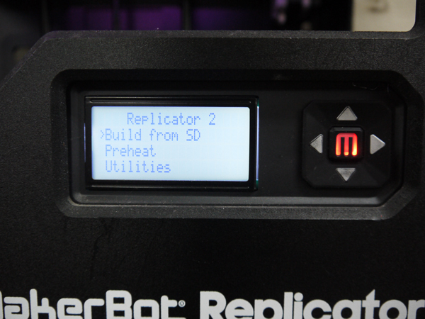

# 08.フィラメントの交換
  

## ★フィラメントの取り外し
 

 
 

**1.**　Replicator本体の十字ボタンで **「Utilities」**を選び **「M」ボタン**を押します。

**2.** **「Change Filament」** を選び **「M」ボタン**を押します。

**3.** **「Unload」** を選び **「M」ボタン**を押します。

**4.**　ノズルが加熱され、準備完了を伝えるメロディが鳴ったら、フィラメントを引き抜きます。

**5.** **「M」ボタン** を押し**「exit」**を選択して 再度**「M」ボタン**を押すと終了します。 
 
 
 

## ★フィラメントの取り付け
 

 
 

**1.**　Replicator本体の十字ボタンで **「Utilities」**を選び **「M」ボタン**を押します。

**2.** **「Change Filament」** を選び **「M」ボタン**を押します。

**3.** **「Load」** を選び **「M」ボタン**を押します。

**4.**　ノズルが加熱され、準備完了を伝えるメロディが鳴ったら、 
　　先端を真っ直ぐにしたフィラメントを差し込みます。 
　　差し込んだフィラメントがノズルから十分に押し出されるまで待ちます。 

**5.** **「M」ボタン** を押し**「exit」**を選択して 再度**「M」ボタン**を押すと終了します。 
 
 
 
